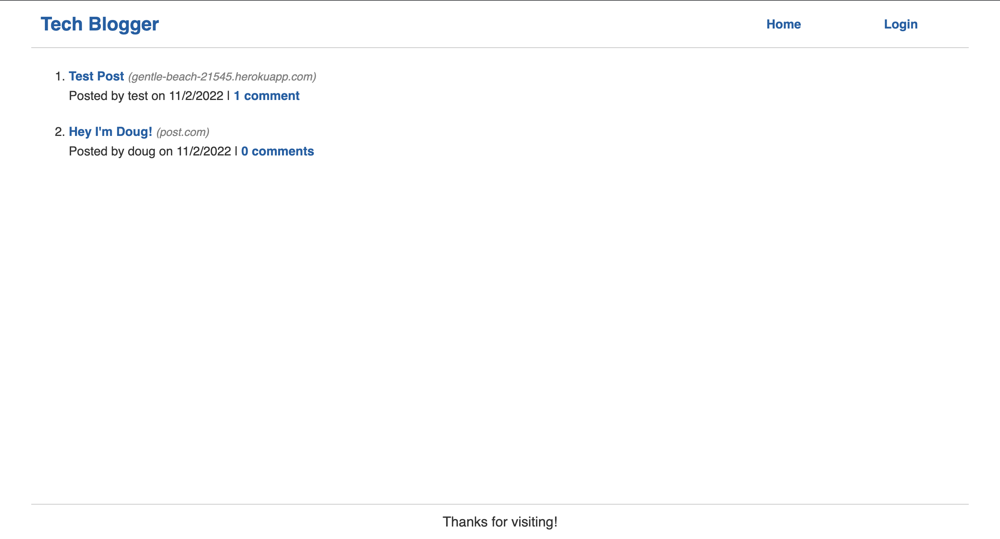
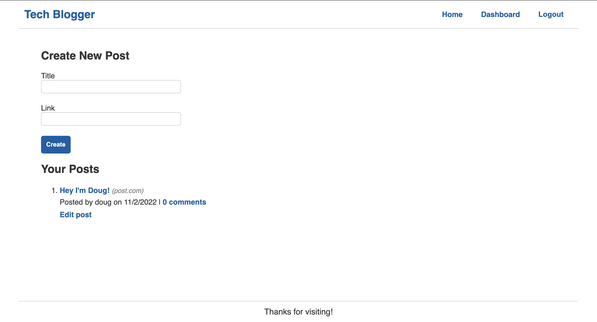

# tech_blogger

## Description

This tech_blogger application is a CMS style blog site that allows users to share information to other users and also comment on posts shared by other users. This blogger was developed to provide people in the software development world a place to easily communicate and get useful and/or interesting information spread to others. Once an account has been created, the sharing begins!

## Photos

## Usage

To use this application, start by visiting https://gentle-beach-21545.herokuapp.com/. The first page the user will see is the homepage where all posts made by other users (if any) will be displayed.

If this is the first time visiting the site, the user will need to create an account by clicking the 'login' button at the top right hand corner in order to utilize all of the features. Once the user has provided a valid username, email, and password, they should be redirected to the homepage where they will see a list of posts made by other users. When a user successfully creates an account or logs in, the navigation bar at the top right hand corner should display 'Home', 'Dashboard', and 'Logout'.

## Languages/Technologies

- HTML
- CSS
- Javascript
- Node.js
- Mysql

## Questions

### How to reach me:

GitHub: [tguy5837](https://github.com/tguy5837)

Email: [tguy5837@gmail.com](mailto:tguy5837@gmail.com)
